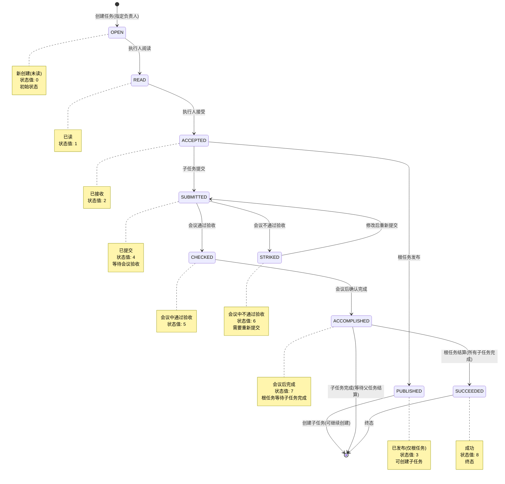
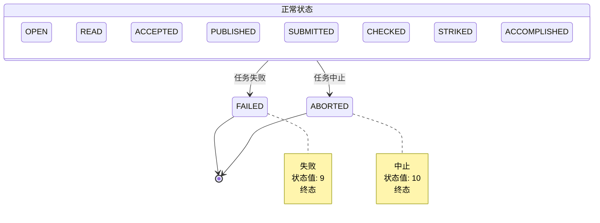
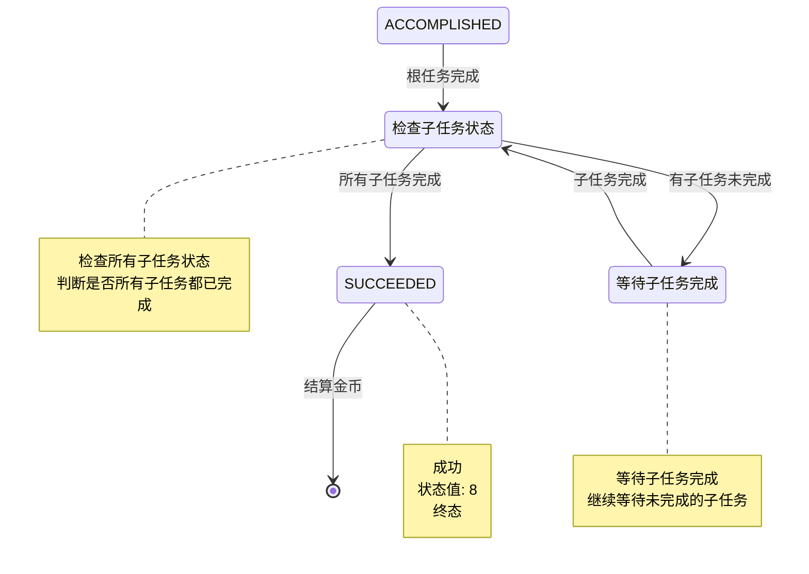

# 任务管理模块 - 业务概述

> **返回**: [文档首页](../README.md)  
> **前端文档**: [任务管理模块 - 前端文档](../frontend/task.md)  
> **后端文档**: [任务管理模块 - 后端文档](../backend/task.md)

## 目录

- [1. 模块概述](#1-模块概述)
- [2. 核心业务概念](#2-核心业务概念)
- [3. 业务流程](#3-业务流程)
- [4. 业务规则](#4-业务规则)
- [5. 模块关联](#5-模块关联)
- [6. 详细文档链接](#6-详细文档链接)

---

## 1. 模块概述

### 1.1 模块定位

任务管理模块是GWEN系统的核心业务模块，负责整个任务驱动的协作流程，从任务创建、分配到完成的全生命周期管理。

### 1.2 核心业务功能

- **任务创建**: 支持根任务和子任务的创建，支持任务分配
- **任务分配**: 支持直接分配方式
- **状态流转**: 严格的任务状态机管理，确保流程规范性
- **金币奖励**: 任务关联金币奖励，支持多种货币类型（灰币/红币/蓝币）
- **任务树管理**: 支持父子任务关系，实现任务层级管理

### 1.3 业务价值

- **任务驱动**: 以任务为核心驱动团队协作
- **激励机制**: 通过金币奖励激励任务完成
- **流程规范**: 通过状态机确保任务流程的规范性

---

## 2. 核心业务概念

### 2.1 任务类型

#### 2.1.1 根任务 vs 子任务

- **根任务**: 没有父任务的任务，从奖金池分配金币，可以发布并创建子任务
- **子任务**: 有父任务的任务，从父任务账户分配金币，不能独立发布


### 2.2 任务状态

| 状态 | 状态值 | 说明 | 可操作 |
|------|--------|------|--------|
| OPEN | 0 | 新创建(未读) | 阅读、接受 |
| READ | 1 | 已读 | 接受 |
| ACCEPTED | 2 | 已接收 | 提交、发布(根任务) |
| PUBLISHED | 3 | 已发布(仅根任务) | 创建子任务 |
| SUBMITTED | 4 | 已提交 | 会议验收 |
| CHECKED | 5 | 会议中通过验收 | 确认完成 |
| STRIKED | 6 | 会议中不通过验收 | 重新提交 |
| ACCOMPLISHED | 7 | 会议后完成 | 成功/失败 |
| SUCCEEDED | 8 | 成功 | - |
| FAILED | 9 | 失败 | - |
| ABORTED | 10 | 中止 | - |

### 2.3 货币类型

- **灰币**: 基础货币，用于日常任务奖励
- **红币**: 高价值货币，用于重要任务奖励
- **蓝币**: 特殊货币，用于补偿和惩罚机制

### 2.4 任务类型

- **功能设计** (0): function_design
- **UI设计** (1): ui_design
- **日常运营** (2): daily_op
- **故障运营** (3): fault_op
- **咨询服务** (4): consulting_service
- **开发测试** (5): dev_and_test
- **管理** (6): manage

---

## 3. 业务流程

### 3.1 任务创建流程

```
1. 用户创建任务
   ↓
2. 选择任务类型（根任务/子任务）
   ↓
3. 设置任务信息（标题、描述、类型、金币、时间等）
   ↓
4. 指定负责人（assignee）→ 状态为 OPEN
   ↓
5. 金币分配：
   - 根任务：从奖金池扣除
   - 子任务：从父任务账户扣除
   ↓
6. 创建成功，发送通知
```

### 3.2 任务状态机

任务状态流转遵循严格的状态机规则，使用 mermaid 图表示如下：



### 3.3 异常流程

任务可以在任何状态下进入异常状态（FAILED 或 ABORTED）：



### 3.4 根任务结算流程

根任务完成后的结算流程：



---

## 4. 业务规则

### 4.1 任务创建规则

1. **描述必填**: 任务描述不能为空
2. **金币限制**: 创建任务时金币不能超过可用金币
3. **子任务限制**: 只有可分发（could_dispatch=true）的父任务才能创建子任务
4. **负责人必填**: 创建任务时必须指定负责人（assignee）

### 4.2 状态流转规则

1. **严格状态机**: 只能按照预定义的状态流转，不能跳跃
2. **权限控制**: 只有特定角色可以执行状态转换
3. **根任务特殊规则**: 只有根任务可以发布（PUBLISHED）
4. **验收规则**: 只有通过会议验收的任务才能进入完成状态

### 4.3 金币分配规则

#### 4.3.1 任务创建时

- **根任务**: 从奖金池扣除红币
- **子任务**: 从父任务账户扣除红币

#### 4.3.2 任务成功时

- **红币结算**: 任务红币支付给执行人（assignee）
- **蓝币结算**: 如果任务已通过验收，分配人（assignor）支付蓝币给执行人

#### 4.3.3 任务失败时

- **退红币**: 任务红币退还给上级任务或奖金池
- **蓝币结算**: 如果任务已通过验收，分配人支付蓝币给执行人
- **失败祖先补偿**: 失败祖先的分配人支付蓝币给当前任务的分配人

#### 4.3.4 任务中止时

- **退红币**: 任务红币退还给上级任务或奖金池
- **蓝币结算**: 如果任务已通过验收，分配人支付蓝币给执行人

### 4.4 权限规则

#### 4.4.1 任务创建

- 所有用户都可以创建任务
- 根任务通常由项目负责人创建

#### 4.4.2 任务操作

- **阅读任务**: 任务负责人、分配人、验收人可以查看
- **接受任务**: 只有任务负责人可以接受
- **提交任务**: 只有任务负责人可以提交
- **发布任务**: 只有根任务的分配人可以发布
- **删除任务**: 只有任务分配人可以删除（且任务状态允许）

#### 4.4.3 任务结算

- **成功结算**: 只有根任务的分配人可以执行
- **失败/中止**: 只有任务分配人或项目负责人可以执行

### 4.5 任务树规则

1. **层级限制**: 支持多级任务树结构
2. **结算依赖**: 根任务必须等所有子任务完成后才能成功结算
3. **金币传递**: 子任务的金币来自父任务账户

---

## 5. 模块关联

### 5.1 与会议系统关联

- 任务可以在会议中进行验收（CHECKED/STRIKED）
- 会议可以关联任务，讨论任务进展
- 任务状态变更会触发会议通知

### 5.2 与项目系统关联

- 任务可以关联项目 Issue
- Issue 可以关联到任务，跟踪任务相关的问题
- 项目成员可以创建和管理任务

### 5.3 与财务系统关联

- 任务金币分配和结算涉及财务账户
- 任务奖励通过财务系统记录和统计
- 支持任务相关的收支记录

### 5.4 与用户系统关联

- 任务分配涉及用户（assignee/assignor）
- 任务权限基于用户角色
- 用户对账明细包含任务奖励记录

### 5.5 与代码文档系统关联

- 任务可以关联 Wiki 任务（wiki_task_id）
- 代码文档可以关联到任务
- 支持从代码文档创建任务需求

---

## 6. 详细文档链接

### 6.1 前端文档

详细的前端实现文档请参考：[任务管理模块 - 前端文档](../frontend/task.md)

包含内容：
- 页面结构和路由
- 组件结构和说明
- Store 状态管理
- API 调用规范
- 交互流程
- UI 规范
- 权限控制
- 快捷键支持

### 6.2 后端文档

详细的后端实现文档请参考：[任务管理模块 - 后端文档](../backend/task.md)

包含内容：
- 数据模型（Model/Schema）
- API 规范（Controller/Route）
- 业务逻辑流程（Service/UseCase）
- 权限与鉴权规则
- 错误码和响应规范
- 定时任务/队列处理/事件

---

**文档版本**: v1.1  
**最后更新**: 2025-01-20  
**维护者**: GWEN开发团队
